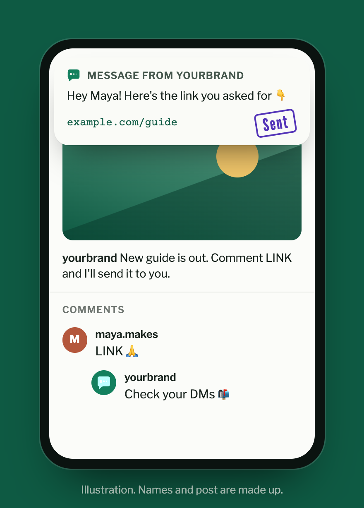
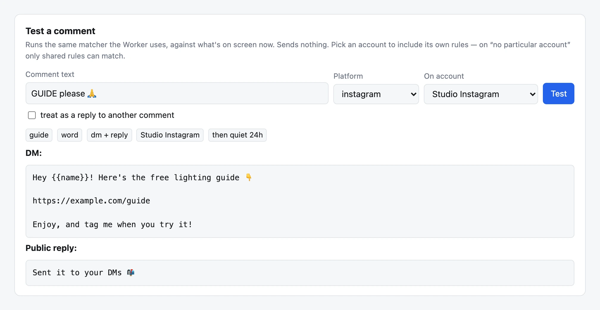
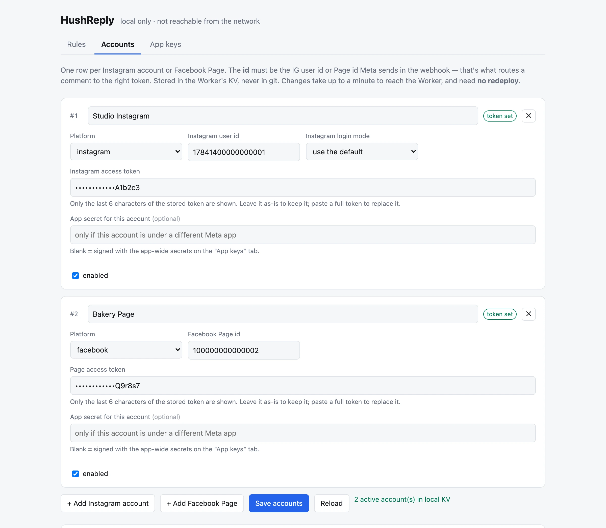

<div align="center">


**The free, open-source ManyChat alternative for comment-to-DM**<br>
Someone comments a keyword on your Instagram or Facebook post — they get a DM automatically.

[](https://deploy.workers.cloudflare.com/?url=https://github.com/lakpriya1s/hushreply)

[](https://github.com/lakpriya1s/hushreply/actions/workflows/ci.yml)
[](./LICENSE)
[](https://workers.cloudflare.com)
[](#is-it-really-free)
[](https://lakpriya1s.github.io/hushreply/)

**[Website](https://lakpriya1s.github.io/hushreply/)** · [Setup guide](docs/setup.md) · [Rules](docs/rules.md) · [Dashboard](docs/dashboard.md) · [Troubleshooting](docs/troubleshooting.md)

</div>

---

`HushReply` turns a public comment into a private reply. You post *"Comment **LINK** and I'll send it
to you"*, someone comments `LINK 🙏`, and within a second:

<p align="center">
  
</p>

- **A private DM** — sent through Meta's official *private replies* API, greeting them by name. No
  scraping, no browser automation, no password sharing.
- **A public reply** *(optional)* — e.g. *"Check your DMs 📬"*, rotating between your variants so it
  never looks canned.
- **A like** *(optional, Facebook Pages)* — so the commenter sees you noticed.

It runs as one small Cloudflare Worker **in your own Cloudflare account, on the free plan** — no SaaS,
no monthly fee, no contact limits, and nobody else holds your tokens or your followers' data. Rules,
accounts and keys are managed from a **[point-and-click dashboard](#the-dashboard)**, so you never
have to hand-edit a file.

---

## Contents

- [What you get](#what-you-get) — everything HushReply does today
- [HushReply vs ManyChat](#hushreply-vs-manychat) — the honest comparison
- [Quick start](#quick-start) — Deploy to Cloudflare, connect Meta, go live
- [🤖 Kickstart with your AI agent](#-kickstart-with-your-ai-agent) — let Claude Code, Cursor & co. walk you through setup
- [Requirements](#requirements)
- [The dashboard](#the-dashboard) — rules, accounts and keys in forms
- [Writing rules](#writing-rules)
- [Configuration](#configuration) — every var and secret
- [Commands](#commands)
- [Is it really free?](#is-it-really-free) — Cloudflare's free-plan limits
- [How it works](#how-it-works)
- [Troubleshooting](#troubleshooting) · [FAQ](#faq) · [Roadmap](#roadmap)
- [Contributing](#contributing) · [License](#license)

## What you get

| | What you get |
|---|---|
| 💬 | **Instagram + Facebook Pages** — comment-to-DM on Instagram professional accounts and Facebook Pages, from one deployment |
| 🔑 | **Keyword rules** — six match modes: `word` (the default; Unicode-aware, so `LINK🙏` and `link!` match but `linked` doesn't), `contains`, `exact`, `starts`, `regex`, and `any` for catch-alls |
| 🎯 | **Filters** — limit a rule to one platform or specific posts, skip comments containing words like "spam", choose whether replies to other comments count |
| ↩️ | **Public replies & likes** — rotating reply variants, chosen from the comment id so a redelivered webhook never posts a *second, different* reply; likes on Facebook |
| ✅ | **Honest replies** — if the DM fails, the "check your DMs" reply is held back instead of posting something untrue |
| 👥 | **Multiple accounts** — every Instagram account and Page you own, each with **its own rule list**, plus **shared** rules for all of them |
| 🖥️ | **[Dashboard](#the-dashboard)** — edit rules, accounts and keys in forms, test a comment before it goes live, publish with one click |
| 🛡️ | **Safety built in** — signature-verified webhooks, every comment claimed exactly once, a self-reply guard so it never answers itself, per-person cooldowns |
| 🧪 | **Test mode** — `DRY_RUN` logs every match without sending anything |
| 🔄 | **Token refresh** — a daily cron keeps 60-day Instagram tokens alive, per account |
| 📄 | **Legal pages built in** — the `/privacy`, `/terms` and `/data-deletion` pages Meta's app settings ask for |
| 🚫 | **No Meta App Review** — an app that only touches accounts you own gets Standard Access automatically ([citations](docs/meta-research.md#1-do-you-need-app-review-for-your-own-account-no--corrected-2026-08-12)) |
| 💸 | **$0** — runs on Cloudflare's free plan; [about 500 keyword-matching comments a day](#is-it-really-free) |

## HushReply vs ManyChat

ManyChat is great, but comment-to-DM is the only feature many creators and small shops actually use —
and as of October 2026 ManyChat's free plan stops at **25 active contacts**, with paid plans from
**$14/month** that grow with your audience.<sup>[1](#footnotes)</sup> One viral post can push you up a tier.

| | **HushReply** | **ManyChat** |
| --- | --- | --- |
| Price | **$0**, on your own free Cloudflare account | Free up to 25 contacts, then from $14/mo (Pro from $29/mo for 2,500 contacts)<sup>[1](#footnotes)</sup> |
| Contact limit | **None** | Priced by active contacts |
| Instagram comment → DM | ✅ | ✅ |
| Facebook Page comment → DM | ✅ | ✅ |
| Public reply to the comment | ✅ with rotating variants | ✅ |
| Multiple accounts | ✅ Every account you own, each with its own rules | Each account is its own subscription |
| Where your data lives | **Your** Cloudflare account | ManyChat's servers |
| Open source | ✅ AGPL-3.0 | ❌ |
| Visual flow builder | ❌ Keyword rules, edited in the dashboard | ✅ |
| Broadcasts, sequences, live chat inbox | ❌ | ✅ |
| Story replies, follow-to-unlock | ❌ Not yet ([roadmap](#roadmap)) | ✅ |
| Setup time | ~30–60 min, once — mostly creating a Meta app | Minutes |

If you need flows, broadcasts or an inbox, ManyChat is the better tool. If you need *"comment the
keyword, get the DM"* without a monthly bill, use HushReply.

## Quick start

1. **Create a Meta app** and collect its secrets and tokens — [docs/setup.md](docs/setup.md) walks
   through every screen. This is the longest step, and it's all clicking.
2. **Click [Deploy to Cloudflare](https://deploy.workers.cloudflare.com/?url=https://github.com/lakpriya1s/hushreply).**
   It copies this repo into your GitHub, creates the Worker and its storage, and asks for your
   secrets.
3. **Connect the webhook.** In your Meta app's webhook settings, paste
   `https://hushreply.<your-subdomain>.workers.dev/webhook` and your `VERIFY_TOKEN`.
4. **Test it.** Comment `LINK` on one of your posts. HushReply ships in **test mode**, so the match
   shows up in Cloudflare → your Worker → **Logs** without anything being sent.
5. **Go live.** In *your* GitHub copy, edit `wrangler.toml`: set `DRY_RUN = "false"` and your
   `CONTACT_EMAIL`, then commit. Cloudflare redeploys automatically.

Then manage everything from the [dashboard](#the-dashboard) — add keywords, add more accounts, test
comments.

> Prefer the terminal? `npm install && npx wrangler login && npx wrangler deploy`, then set each
> secret with `npx wrangler secret put <NAME>`. See [docs/setup.md](docs/setup.md#path-b-the-cli).

## 🤖 Kickstart with your AI agent

Paste this into your AI coding agent (Claude Code, Cursor, opencode, …) and let it walk you through
the setup:

```text
I want to set up HushReply (https://github.com/lakpriya1s/hushreply), a free
comment-to-DM bot for my own Instagram account and/or Facebook Page. Help me
set it up step by step:

1. Read README.md and docs/setup.md to understand what's needed.
2. Walk me through creating the Meta app and collecting META_APP_SECRET,
   IG_APP_SECRET, a VERIFY_TOKEN, and my account ids and tokens — one screen
   at a time, waiting for me to confirm each step.
3. Help me deploy with the Deploy to Cloudflare button (or wrangler) and set
   the secrets.
4. Help me connect the webhook in my Meta app and subscribe the right fields
   for Instagram and Facebook.
5. Help me write my first rule, test it in DRY_RUN mode, then go live.

Never ask me to paste secrets or tokens into this chat — have me set them in
the Cloudflare dashboard or with `npx wrangler secret put` instead.
```

## Requirements

- **A public Instagram professional account** (Business or Creator) with *Settings → Messages → Allow
  access to messages* turned on, and/or a **Facebook Page** you manage
- **A Meta developer account** — free, at [developers.facebook.com](https://developers.facebook.com)
- **Cloudflare and GitHub accounts** — both free
- **[Node.js](https://nodejs.org/) 22.18 or newer** — only for the dashboard or the CLI path; the
  Deploy button needs nothing installed

## The dashboard

HushReply comes with a dashboard for everything you'd otherwise edit by hand. It runs on your own
computer and talks to your own Cloudflare account — so your tokens never sit behind a login page on
the internet.

<p align="center">
  
</p>

| Tab | What you do there | Goes live |
| --- | --- | --- |
| **Rules** | Keyword, message, reply variants, cooldown and filters as form fields. A tab per account plus **Shared**. Add, reorder, duplicate, switch off. Mistakes are highlighted and can't be saved. | When you click **Commit & push** (or **Deploy**) |
| **Accounts** | Add every Instagram account and Facebook Page you own. Tokens are masked on screen and never written to a file. | Within a minute — no redeploy |
| **App keys** | Paste your Meta app secret, Instagram app secret and verify token. | Immediately |

The **Test a comment** box runs the same matcher the Worker uses: type `GUIDE please 🙏`, pick an
account, and see which rule fires plus the exact DM and reply. Nothing is sent.

<p align="center">
  
  
</p>

Open it with:

```sh
# the first time — clone YOUR copy (the one the Deploy button created)
git clone https://github.com/YOUR-NAME/hushreply
cd hushreply
npm install
npx wrangler login        # opens Cloudflare in your browser to sign in

# every time after that
npm run dashboard         # opens http://127.0.0.1:8790 in your browser
```

Change a rule, click **Save**, then **Commit & push** — the dashboard commits `rules.json` to your
GitHub copy and Cloudflare redeploys within a couple of minutes. Full guide:
[docs/dashboard.md](docs/dashboard.md).

> **Do I need it?** For one Instagram account and one Facebook Page, no — the Deploy button and
> GitHub's web editor are enough. For several accounts, or if you'd rather fill in forms than edit
> JSON, yes.

## Writing rules

Rules live in [`rules.json`](rules.json) and ship inside the Worker. Use the
[dashboard](#the-dashboard), or edit the file **in GitHub's web editor** and commit — Cloudflare
rebuilds and redeploys on every push.

```json
{
  "id": "link",
  "keyword": "LINK",
  "dm": "Hey {{name}}! Here's the link you asked for 👇\n\nhttps://example.com",
  "publicReply": ["Just sent it to your DMs 📬", "Check your DMs {{name}} 📬"]
}
```

The first matching rule wins, an account's own rules are checked before the shared ones, and a
catch-all (`"match": "any"`) ships disabled — replying to every comment is how you get reported as
spam. Every field, per-account rules and catch-all patterns: [docs/rules.md](docs/rules.md).

## Configuration

**Vars** live in [`wrangler.toml`](wrangler.toml) — change them there and commit (a deploy resets any
var edited in the Cloudflare dashboard). **Secrets** are set when you click Deploy, and changed later in
Cloudflare → your Worker → **Settings → Variables and Secrets**, on the dashboard's **App keys** tab, or
with `npx wrangler secret put <NAME>`.

| Key | Kind | Default | Description |
| --- | --- | --- | --- |
| `DRY_RUN` | var | `"true"` | Log matches without sending anything. Set `"false"` to go live. |
| `CONTACT_EMAIL` | var | `you@example.com` | Shown on the `/privacy`, `/terms` and `/data-deletion` pages. Use a real inbox. |
| `APP_NAME` | var | `HushReply` | Your app or brand name on those pages. |
| `LEGAL_NAME` | var | *(empty)* | The person or company responsible, if different from `APP_NAME`. |
| `IG_LOGIN_MODE` | var | `instagram` | `instagram` (Instagram Login) or `facebook` (Instagram via a Page). Overridable per account. |
| `GRAPH_VERSION` | var | `v26.0` | Meta Graph API version. |
| `DISABLE_SELF_COMMENT_GUARD` | var | `"false"` | Testing only — keep `"false"`. |
| `DISABLE_COOLDOWN` | var | `"false"` | Testing only — keep `"false"`. |
| `META_APP_SECRET` | secret | — | Meta app → App settings → Basic → App secret. |
| `IG_APP_SECRET` | secret | — | Meta app → Instagram → API setup with Instagram login. A *different* value; Instagram webhooks are signed with it. |
| `VERIFY_TOKEN` | secret | — | Any random string; paste the same value into Meta's webhook settings. |
| `IG_USER_ID` / `IG_ACCESS_TOKEN` | secret | — | Optional quick-start Instagram account. Leave blank to skip. |
| `FB_PAGE_ID` / `FB_PAGE_TOKEN` | secret | — | Optional quick-start Facebook Page. Leave blank to skip. |

For more than one account per platform, add them on the [dashboard](#the-dashboard)'s **Accounts** tab
instead — once it holds any, the four quick-start secrets are ignored.

## Commands

Open the local dashboard (rules, accounts, app keys).

```sh
npm run dashboard
```

Run the Worker locally on `:8787` (copy `.dev.vars.example` to `.dev.vars` first).

```sh
npm run dev
```

Fire a correctly-signed fake comment at a running Worker — no real comment needed.

```sh
node scripts/send-test.mjs instagram "LINK please"
node scripts/send-test.mjs facebook "what is the price?"
TARGET=https://hushreply.<your-subdomain>.workers.dev/webhook node scripts/send-test.mjs instagram LINK
```

Deploy from your machine (Deploy-button copies redeploy on every `git push` instead).

```sh
npm run deploy
```

Stream live production logs.

```sh
npm run tail
```

Run the unit tests and the typecheck.

```sh
npm test
npm run typecheck
```

## Is it really free?

Yes — within Cloudflare's free plan, which is generous for this job:

| Free-plan limit | What it means for HushReply |
| --- | --- |
| 100,000 Worker requests/day | Every comment webhook is one request. Far more than most accounts get. |
| 1,000 KV writes/day | The real ceiling: about **500 keyword-matching comments a day**. Comments that match no rule cost **zero** writes. |
| 100,000 KV reads/day | Roughly 20× more headroom than writes. |

Viral post? [Workers Paid](https://developers.cloudflare.com/workers/platform/pricing/) is **$5/month**
for the whole Cloudflare account and lifts the limits by orders of magnitude — still a flat fee, not
a per-contact one.

**Limits that come from Meta, not HushReply:** one private reply per comment, ever; it must be sent
within 7 days of the comment; and only comments on **your own** posts can be answered privately.

## How it works

```
Meta webhook → verify signature → parse → find account → find rule → claim (KV) → cooldown → DM → reply/like
```

The Worker answers Meta with `200` immediately and does the Graph API work in the background, since
Meta retries anything slow. Every comment id is claimed in KV before any work happens, so redeliveries
are no-ops. Rules are compiled into the Worker at deploy time; accounts and tokens live in KV, so adding
an account needs no redeploy. A daily cron refreshes Instagram tokens. The full architecture and the
invariants that keep it safe are in [CLAUDE.md](CLAUDE.md#architecture).

## Troubleshooting

- **Instagram comments never arrive** — the account must be **public** and **professional** with
  *Allow access to messages* on, and Instagram needs **two** webhook subscriptions (the app-level
  `comments` field *and* `subscribed_apps` on the account) — see [docs/setup.md](docs/setup.md).
- **`bad signature` in the logs** — Instagram Login apps sign webhooks with the separate
  `IG_APP_SECRET`, not `META_APP_SECRET`. Set both.
- **Meta says the callback URL couldn't be verified** — `VERIFY_TOKEN` isn't set on the Worker, or
  doesn't match what you typed into Meta.
- **The match shows in the logs but no DM arrives** — check `DRY_RUN` is `"false"`; Meta also allows
  only one private reply per comment, within 7 days.
- **The dashboard can't find the KV namespace** — deploy once, or paste the namespace id into
  `wrangler.toml` ([details](docs/dashboard.md#finding-the-kv-namespace)).

Everything else — Meta's error codes, token expiry, the free-tier limit — is in
[docs/troubleshooting.md](docs/troubleshooting.md).

## FAQ

<details>
<summary><strong>Is this allowed by Meta?</strong></summary>

Yes. It uses Meta's official Graph API — the same *private replies* feature ManyChat and similar tools
use. No scraping, no logging in as you. Meta's normal messaging rules still apply, so don't spam people.
</details>

<details>
<summary><strong>Do I need Meta App Review?</strong></summary>

Not for accounts you own or manage yourself. Meta grants Standard Access automatically to an app
that only touches its own operator's Pages and Instagram accounts. See
[docs/meta-research.md §1](docs/meta-research.md).
</details>

<details>
<summary><strong>Can I run it for my clients' accounts?</strong></summary>

Technically yes — multiple accounts are built in. But serving accounts you don't own is Meta's
"Tech Provider" scenario, which **does** need Advanced Access through App Review. Each client can
also deploy their own copy for free.
</details>

<details>
<summary><strong>Do I need to know how to code?</strong></summary>

No. The Deploy button asks for everything it needs, and the [dashboard](#the-dashboard) turns rules,
accounts and keys into forms. The dashboard runs on your computer, so you install Node.js once and
copy-paste a few commands. With one Instagram account and one Page you can skip it and edit rules in
GitHub's web editor.
</details>

<details>
<summary><strong>Where do my tokens and data go?</strong></summary>

Your Cloudflare account and nowhere else. HushReply stores comment ids (for 7 days, to dedupe),
cooldown timestamps and your account tokens in your own KV namespace. The deployed Worker has no
admin page and no login — there's nothing to break into.
</details>

## Roadmap

- Thank-you DM when someone mentions you in their Story
- Instagram comment likes (if Meta exposes it to Instagram Login apps)
- Follow-to-unlock: only send the DM to followers
- Optional D1 storage for very high comment volume on the free plan
- Quick-reply buttons in the DM

Ideas and votes welcome in [Issues](https://github.com/lakpriya1s/hushreply/issues).

## Contributing

```sh
git clone https://github.com/lakpriya1s/hushreply.git
cd hushreply
npm install
npm test && npm run typecheck
```

See [`CLAUDE.md`](./CLAUDE.md) for the architecture and the safety invariants a PR must not break, and
[CONTRIBUTING.md](CONTRIBUTING.md) for the rest. Report security issues privately via
[SECURITY.md](SECURITY.md). Issues and PRs welcome — and if HushReply saved you a subscription, a ⭐
helps others find it.

## License

[AGPL-3.0](./LICENSE) © Lakpriya Senevirathna — free to use, modify and self-host. If you run a
modified version as a service for others, you must publish your changes under the same license.

---

<a id="footnotes"></a>
<sup>1</sup> ManyChat prices as of October 2026, annual-billing rates, from third-party roundups of
[manychat.com/pricing](https://manychat.com/pricing). Check their site for current pricing.

HushReply is an independent open-source project, **not affiliated with, endorsed by or sponsored by
Meta Platforms, Inc. or ManyChat, Inc.** Instagram and Facebook are trademarks of Meta Platforms, Inc.;
ManyChat is a trademark of ManyChat, Inc.

<div align="center">
<sub>Public comment in · private reply out ·  HushReply</sub>
</div>
