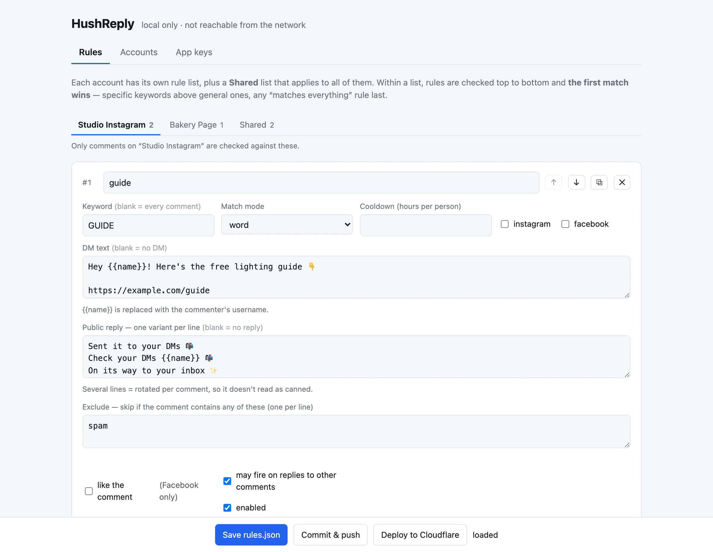

# The local dashboard

A small web app that runs **on your own machine** and edits HushReply's three kinds of configuration:
rules, accounts, and app secrets. It's optional. You need it for:

- **More than one Instagram account or Facebook Page.** The Deploy button's four secrets cover one of
  each; the dashboard stores any number.
- **Editing rules with validation and a live preview** instead of hand-editing JSON.

```bash
npm run dashboard        # opens http://127.0.0.1:8790 in your browser
```



Other docs: [setup.md](setup.md) · [rules.md](rules.md) · [troubleshooting.md](troubleshooting.md)

---

## Requirements

- **A local clone of your repo.** If you used the Deploy button, clone *your copy*
  (`github.com/<you>/hushreply`), not the original. Then `npm install`.
- **Node.js 22.18 or newer.** The dashboard imports the Worker's TypeScript source directly, which
  needs Node's built-in type stripping.
- **Wrangler logged in to your Cloudflare account:** `npx wrangler login`. The dashboard does all its
  Cloudflare work through your local `wrangler` CLI.

Port 8790 taken? `PORT=8791 npm run dashboard`. Don't want a browser tab opened for you?
`NO_OPEN=1 npm run dashboard`.

---

## It is local-only, on purpose

- It binds to `127.0.0.1` and rejects requests whose `Host` header isn't loopback. Nothing else on
  your network can reach it, which is why it has **no login**.
- It is **never deployed**. The Worker has no admin routes at all: nothing that reads or writes
  credentials, nothing to guess a password for. The only way to change your tokens is through a
  terminal that's already logged in to your Cloudflare account.
- **Don't put it behind a tunnel or reverse proxy.** It writes files, stores credentials and can run
  deploys, all without authentication.

---

## The three tabs

| Tab | Edits | Stored in | Needs a deploy? |
| --- | --- | --- | --- |
| **Rules** | keywords, DM and reply text, per account | `rules.json` in your repo | **yes** |
| **Accounts** | your IG accounts and Pages, with their tokens | the Worker's KV, key `accounts` | no |
| **App keys** | `META_APP_SECRET`, `IG_APP_SECRET`, `VERIFY_TOKEN` | Worker secrets | no |

### Rules

A strip of buttons along the top switches which list you're editing: one per account, then
**Shared** (rules for every account). Add, duplicate, reorder and delete act on the visible list. A
rule's scope comes from the list it's in, so there's no per-rule "accounts" field. See
[rules.md](rules.md) for what every field does.

- **It validates before saving.** A rule with nothing to do, a broken regex, a like-only Instagram
  rule, or two rules sharing an id in one list are refused, with the row highlighted. If the problem
  is in a list you're not looking at, that list's button shows a red count. `rules.json` is never
  left in a state where the Worker would drop rules.
- **The Test box** runs the Worker's real matcher (the dashboard imports `src/rules.ts` directly)
  against the rules on screen, saved or not. Type a comment, pick the platform and account, and see
  which rule fires and the exact DM and reply text. Nothing is sent to Meta. Use it to catch ordering
  mistakes, since the first match wins.
- **An amber tab** is a `byAccount` list whose name matches no configured account, usually because the
  account was renamed. Its rules can never fire until you rename or move them.

**Save rules.json** writes the file. That doesn't change the live Worker yet, because rules are
compiled into it. To ship the change:

- **If you used the Deploy button:** click **Commit & push**. It appears whenever your folder is
  connected to GitHub. It commits `rules.json` (and nothing else) and pushes it, and Workers Builds
  redeploys from GitHub within a couple of minutes. The same by hand:

  ```bash
  git add rules.json && git commit -m "Update rules" && git push
  ```

  **Don't use the dashboard's Deploy button here.** It deploys from your machine, and the next push
  to GitHub deploys whatever `rules.json` is in GitHub, silently undoing anything you didn't push.
- **If you deploy from the CLI:** **Deploy to Cloudflare** runs `wrangler deploy` and streams its
  output. Commit `rules.json` too, so git matches what's live.

### Accounts

Each row is one Instagram professional account or one Facebook Page:

| Field | Notes |
| --- | --- |
| Label | Your name for it. Shown in logs and used as its `byAccount` key in `rules.json`. |
| Id | The IG user id or Page id, **digits only**. It must be exactly the id Meta sends in webhooks; that's how a comment is routed to the right token. |
| Token | The Instagram access token or Page access token. |
| App secret | Optional. Only for an account that belongs to a **different** Meta app than your main one. Leave blank otherwise. |
| Instagram login mode | Instagram only. Overrides the `IG_LOGIN_MODE` default per account, so Instagram Login and Facebook Login accounts can coexist. |
| Enabled | Untick to park an account without deleting it. |

**Save accounts** writes them to KV. **No redeploy needed.** The Worker caches the list for 60
seconds, so a change takes up to a minute to apply.

Saving is refused if an id isn't all digits (a trailing dot from a copy-paste is the classic case)
or if a token is exactly 32 hex characters, which means you pasted the **app secret** instead of the
access token next to it.

The checkbox *edit the local KV used by `npm run dev` instead of production* switches the tab to the
local development store, for testing with `npm run dev`.

### App keys

Sets the three app-wide secrets with `wrangler secret put`. Shows which are already set (names only,
never values). Takes effect immediately, no redeploy.

---

## Setting up several accounts

1. Wire each account up on Meta's side first, exactly as in [setup.md](setup.md): connect it to the
   app, get its token, subscribe its webhooks, and for a Page run the `subscribed_apps` call. The
   dashboard only tells the Worker which token to use; it doesn't touch Meta.
2. `npm run dashboard` → **Accounts** → **+ Add Instagram account** or **+ Add Facebook Page**. Fill in
   label, id and token. Repeat for each.
3. **Save accounts.** From now on the Worker uses this list, and the four `IG_*` / `FB_*` quick-start
   secrets are ignored. They can be deleted:

   ```bash
   npx wrangler secret delete IG_USER_ID      # and IG_ACCESS_TOKEN, FB_PAGE_ID, FB_PAGE_TOKEN
   ```

   Keep `META_APP_SECRET`, `IG_APP_SECRET` and `VERIFY_TOKEN`.
4. **Rules** → each account now has its own button. Give accounts their own rules, or keep using
   **Shared**. Save, then push (or deploy).
5. Check `/health` on your Worker: `accountCount` should match.

Things that work per account automatically:

- **Cooldowns.** The same person commenting on two of your accounts can get a DM from each.
- **Token refresh.** The daily cron refreshes every Instagram Login token on its own; one account's
  dead token doesn't stop the others.
- **The self-comment guard** treats every configured account as "you", so two of your accounts never
  answer each other.

To test a specific account with fake webhooks, give `scripts/send-test.mjs` its id:

```bash
ACCOUNT=<ig-user-id-or-page-id> node scripts/send-test.mjs instagram LINK
```

**Only your own accounts.** Running HushReply for someone else's Page or Instagram account (a
client's, say) makes you a "Tech Provider" in Meta's terms, which needs App Review. See
[setup.md](setup.md#app-review).

---

## How credentials are handled

- **Tokens never touch your disk or git.** The dashboard writes accounts to KV through a temp file
  created with `chmod 600` and deleted immediately. It's a temp file rather than a command-line
  argument because anything on a command line is visible to every user on the machine via `ps`.
  App keys are piped to `wrangler secret put` on stdin for the same reason.
- **Stored tokens come back masked**, last 6 characters only. Leave a masked field alone to keep the
  current value; paste a full token to replace it. Saving a label change never wipes a token: the
  server re-reads KV and restores any field that's still masked.
- **Your browser talks only to `127.0.0.1`.** Everything else goes through your logged-in `wrangler`.

---

## Finding the KV namespace

The Accounts tab reads and writes your Worker's KV namespace. The dashboard finds it by itself:

1. If `wrangler.toml` has an `id = "…"` under `[[kv_namespaces]]`, it uses that.
2. Otherwise it looks for the namespace `wrangler deploy` creates, titled `<worker name>-state`
   (`hushreply-state` by default).
3. Failing that, it uses the **single** namespace whose title starts with `<worker name>-`.

If it can't decide (none found, or several match), it says so. Then:

1. Cloudflare dashboard → **Storage & Databases → KV**, and copy the id of your Worker's namespace (or
   your Worker → **Settings → Bindings** shows which one is bound as `STATE`).
2. Add it to `wrangler.toml`:

   ```toml
   [[kv_namespaces]]
   binding = "STATE"
   id = "<namespace id>"
   ```

3. Commit it. A namespace id isn't a secret, and pinning it is harmless for deploys.

---

## Troubleshooting the dashboard

| Symptom | Fix |
| --- | --- |
| A lone `401: Unauthorized` from wrangler | Wrangler's login token expired. The dashboard retries once automatically; if it still fails, run `npx wrangler login`. |
| Edits seem to have no effect, or rules behave like an old version | An older `npm run dashboard` is still running on port 8790 and answering instead. Stop it and start again. |
| `ERR_UNKNOWN_FILE_EXTENSION ".ts"` on start | Node is older than 22.18, so it can't load the Worker's TypeScript. Upgrade (`.nvmrc` says 22). |

More in [troubleshooting.md](troubleshooting.md).
